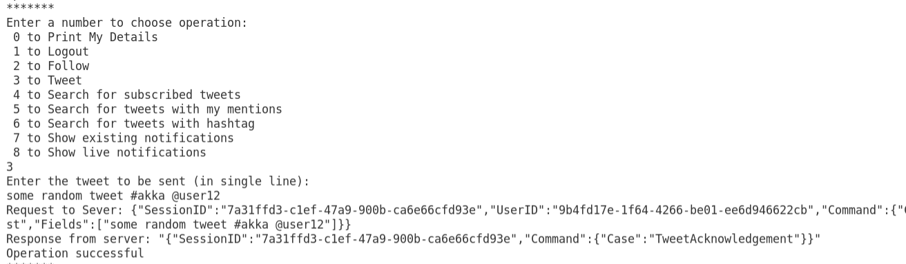
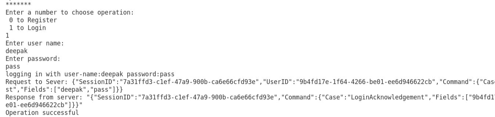

# twitter-clone
A "twitter-clone" built using Akka-FSharp 

#### Instructions to run:
Step-1: Add packages
Commands to add packages:
Please ‘cd’ into the project directory before executing the following commands
```shell
dotnet add package Newtonsoft.Json --version 12.0.3
dotnet add package MathNet.Numerics --version 4.12.0
dotnet add package WebSocketSharp --version 1.0.3-rc11
dotnet add package Suave --version 2.5.6
```
Before running: The server will use port 8082 for web-socket communications. So, please make sure the
port is not already being used.

Step 2: Start the server in a terminal
```shell
dotnet fsi --langversion:preview runServer.fsx
```

Step 3: Start clients in separate terminals
```shell
dotnet fsi --langversion:preview runClient.fsx
```

Just follow instructions on the interactive terminal to perform different operations.





#### Instruction to run simulator:

```shell
dotnet fsi --langversion:preview runSimulator.fsx
```
There are 4 optional parameters:
```
dotnet fsi --langversion:preview runSimulator.fsx <numOfUsers> <reTweetProb> <dynamicTweets>
<disconnectPerc>
```
Example:
```shell
dotnet fsi --langversion:preview runSimulator.fsx 100
dotnet fsi --langversion:preview runSimulator.fsx 100 0 false 0
```

Parameters:


i) <numOfUsers> Integer number of users to be simulated (default is 10)

ii) <reTweetProb>: Optional decimal value (0 to 1; default being zero). Probability that a user
retweet a tweet when it receives a tweet notification

iii) <dynamicTweets>: Optional boolean value (“true” or “false”; default is false). When false each
user will send a fixed number of tweets otherwise number of tweets will be proportional to the
number of followers it has.

iv) <disconnectPerc >: Optional decimal value (0 to 1; default being zero). Percentage of users to be
disconnected (Logout operation) before “tweet” operation start. Disconnected users will be
connected back once tweet operation is over (Uncomment lines in between 438-441 in
runSimulator.fsx to test the performance with disconnected users and different search
operations)


Simulator performs following operations
- Registers provided number of users and performs login operation
- Makes the users subscribe(follow) to other users in a - Zipf distribution. The skew
parameter is configurable in the code.
- Creates and sends random tweets like: “i like coffee #coffelovers @user12 @user9”


This project was created as part of the course Distributed Operating Systems Principles at the University of Florida. under [Prof. Alin Dobra](https://www.cise.ufl.edu/dobra-alin/)